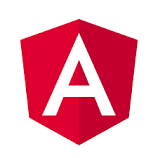

# Hi there , I'm <a href ="https://www.linkedin.com/in/mohamed-nasser-40a404203">Mohamed Nasser!</a>

  
  
   
   ### ”When in doubt, use brute force.⛰“
 
 

##  About Me 

- #### 🎓 Biomedical Engineering Student at <a href="http://eng.cu.edu.eg/ar/">Faculty of Engineering Cairo University</a>

- #### 🤖 Currently I am studding Machine Learning

- #### 👷🏼‍♂️ Software Engineer Intern <a href="https://www.bld.ai/">bld.ai</a>
- #### 📝 Checkout my <a href="https://drive.google.com/drive/folders/135o8oFYte2oZu7lM7wBHjoYdiLtj2z0_?usp=sharing">Resume</a>

- #### 📫 How to reach me <a href="mailto:nassermohamed3222@gmail.com">Mail</a>

- #### 🖐 Available to help

 

## Technical Skills

<ul>
<li>

### Programming languages:

 

<code title="Python"></code>
<code title="Java"></code>
<code title="C"></code>
<code title="C++"></code>
<code title="arduino"></code>
<code title="Assembly"></code>

</li>
<li>

### Frontend Development:

<code title="Html 5"></code>
<code title="CSS"></code>
<code title="SCSS"></code>
<code title="JavaScript"></code>
<code title="React.js"></code>
<code title="Angular"></code>
<code title="Bootstrap"></code>
<code title="firebase"></code>

 
</li>
<li>

### Backend && DataBase Development:

 

<code title="mongodb"></code>
<code title="Django"></code>
<code title="PHP"></code>
<code title="SQl"></code>
<code title="MySQL"></code>

 
</li>
<li>

### Software & Tools:

<code title="Git"></code>
<code title="GitHub"></code>
<code title="StackOverflow"></code>

 
</li>
<li>

## 📫 Connect with me: 

 

  
  
 
  
     

 

 

 

